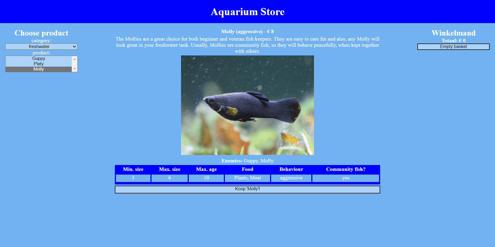

# Voorbeeldexamen WFA@Home

## Algemeen
* In deze PE-opdracht simuleren we het gebruik van aangeleverde JSON. Je leest de data ofwel uit via:
    * een online bron (Github Pages `docs/api/data.json`)
    * of via een lokaal bestand (`js/data.js`)

* Indien je codeduplicatie kan vermijden, dan pas je gaandeweg de code aan.

* **Het is verboden om de reeds bestaande HTML aan te passen.**
* Voorzie een eigen opmaak.

### Opdracht 1
Bekijk de JSON aandachtig. Zorg ervoor dat een gebruiker alle categorieën die beschreven staan in de JSON ziet in de 'category'-`select`.

### Opdracht 2
Wanneer een gebruiker een keuze maakt in de category-`select`, dan verschijnen de verschillende soorten producten (dit kunnen ofwel soorten vissen òf visproducten zijn) in de product-`select`.

### Opdracht 3
Wanneer een gebruiker vervolgens een vis selecteert (of deze standaard geselecteerd werd), dan geef je de details van de geselecteerde vis (saltwater/freshwater) weer. **Producten laat je hier nog eventjes links liggen (deze zijn pas voor opdracht 5)**.

### Opdracht 4 
Maak het vervolgens mogelijk om vissen (saltwater/freshwater) te kopen. Deze worden toegevoegd aan je winkelmand.
Indien het item in de winkelmand al bestaat, dan voeg je aan de reeds bestaande bestelling toe.

Het moet mogelijk zijn om de winkelmand te wissen en de gebruiker ziet steeds de totaalprijs van zijn winkelmand.

### Opdracht 5
Voeg de mogelijkheid toe om bovendien visproducten (dus geen vissen) te kopen.

# Applicatie in werking

